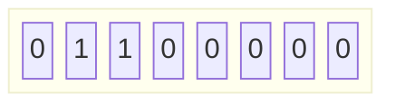
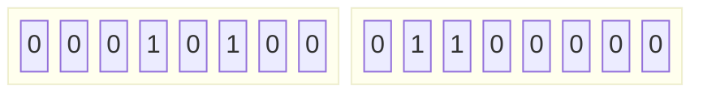
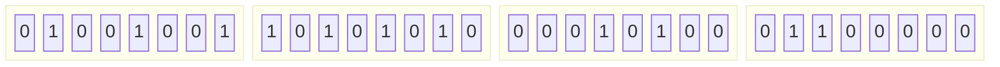
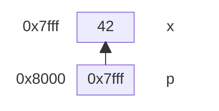
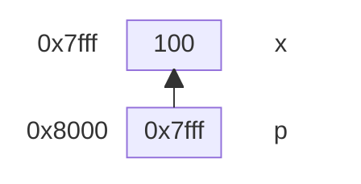
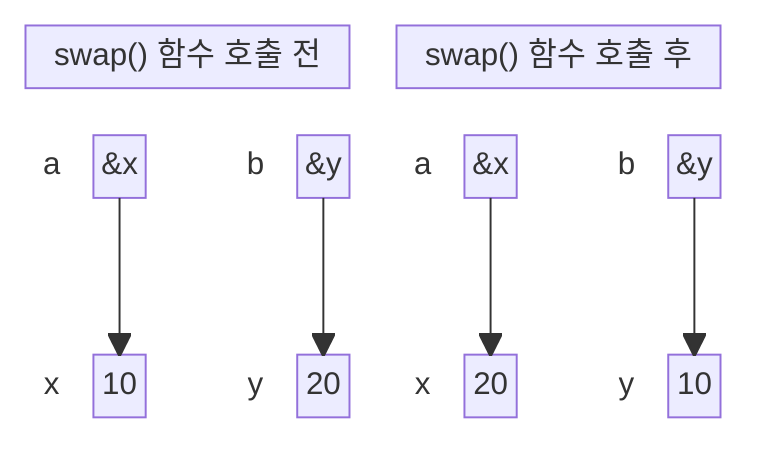

# C Programming 소개

## Junho Kim
## Kookmin University

---
layout: section
---

## C 프로그래밍 소개
# C vs Python: 핵심 차이점
 

---
layout: two-cols-header
---

# C vs Python: 핵심 차이점

Python과 C의 가장 큰 차이는 타입 선언, 컴파일, 메모리 관리입니다.

::left::

## Python

```python
# 타입 선언 불필요 (동적)
x = 10
name = "홍길동"

# 실행: python3 hello.py
print("Hello, World!")

# 메모리 자동 관리 (GC)
my_list = [1, 2, 3]

# 문자열 객체
s = "hello"
print(len(s))   # 5
```

::right::

## C

<!-- ```c {all|1|4-7|9-11|13-15} -->
```c
// 타입 명시 필수 (정적)
int x = 10;
char name[] = "홍길동";

// 컴파일 후 실행
// gcc hello.c -o hello && ./hello
printf("Hello, World!\n");

// 메모리 수동 관리
int* arr = malloc(3 * sizeof(int));
free(arr);

// 문자열 = char 배열
char s[] = "hello";
printf("%zu\n", strlen(s));  // 5
```

---
layout: default
---

# C vs Python: 비교표


| 항목 | Python | C |
|------|--------|---|
| 타입 선언 | 불필요 (동적) | **필수** (정적) |
| 실행 방식 | 인터프리터 | **컴파일** 필요 |
| 메모리 관리 | 자동 (GC) | **수동** malloc/free |
| 문자열 | `str` 객체 | `char` 배열 + `\0` |
| 표준 출력 | `print()` | `printf()` |
| 클래스/OOP | `class` | `struct` (메서드 없음) |
| 문자열 비교 | `s1 == s2` | `strcmp(s1, s2)` |
| 배열 경계 검사 | 자동 | **없음** ⚠️ |


---
layout: default
---

# (이렇게 귀찮음에도) C를 배우는 이유

- 🔧 **시스템 수준** 프로그래밍 이해
- 🧠 **메모리 구조** 직접 제어
- ⚡ **C++의 기반** — 오늘 배우는 것이 C++의 토대
- 🏗️ 운영체제, 임베디드, 게임 엔진의 언어


---
layout: section
---

## C 프로그래밍 소개
# 컴파일 & 빌드 과정

---
layout: default
---
# 첫 번째 C 프로그램

```c
#include <stdio.h>   // 헤더 포함 (Python의 import)

int main(void) {     // 프로그램 진입점 (필수!)
    printf("Hello, World!\n");
    return 0;        // 0 = 정상 종료
}
```

<br>

### 컴파일 & 빌드 과정
```bash
# 기본 컴파일 & 링크 (한 번에)
gcc hello.c -o hello

# 권장 옵션 (경고 + C11 표준)
gcc -Wall -Wextra -std=c11 hello.c -o hello

# 실행
./hello
```

---
layout: default
---

# 자세한 컴파일 & 빌드 과정
<!-- 
<div class="grid grid-cols-2 gap-6">

<div> -->

### 소스 → 실행까지 4단계


<!-- </div>

<div> -->

### 주요 gcc 명령어

```bash
# 기본 컴파일 & 링크 (한 번에)
gcc hello.c -o hello

# 단계별 실행
gcc -E hello.c -o hello.i   # 전처리
gcc -S hello.c -o hello.s   # 어셈블리
gcc -c hello.c -o hello.o   # 오브젝트

# 권장 옵션 (경고 + C11 표준)
gcc -Wall -Wextra -std=c11 hello.c -o hello

# 실행
./hello
```

<!--
Python은 python3 명령 하나면 끝이지만,
C는 컴파일 → 링크 과정을 거쳐야 실행 파일이 만들어집니다.
-->

---
layout: section
---

## C 프로그래밍 소개
# 변수, 자료형, 연산자

---
layout: default
---

# Quiz

> 대한민국은 우편번호 기입을 위해 5칸을 사용합니다. 한 칸마다 0-9까지 십진수(decimal) 기입이 가능합니다.

🤔대한민국에서 5자리 우편번호로 만들 수 있는 서로 다른 우편번호는 몇가지인가요?


---
layout: default
---

# Quiz

> 컴퓨터에서 정보를 저장하는 기본단위는 byte입니다. 1 byte는 8칸으로 구성되어 있으며, 한 칸마다 0 또는 1 이진수(binary) 기입이 가능합니다.

🤔 1 byte에 표현할 수 있는 서로 다른 수는 몇가지인가요?



🤔 2 bytes에 표현할 수 있는 서로 다른 수는 몇가지인가요?



🤔 4 bytes에 표현할 수 있는 서로 다른 수는 몇가지인가요?




---
layout: two-cols-header
---

# 기본 자료형

::left::

### 정수형 & 문자형

```c
// 정수형
char   c = 'A';      // 1 byte  (-128 ~ 127)
short  s = 100;      // 2 bytes
int    i = 42;       // 4 bytes ← 가장 많이 씀
long   l = 1000000L; // 8 bytes

// 부호 없는 정수
unsigned int u = 4294967295U;

// 실수형
float  f = 3.14f;    // 4 bytes (단정밀도)
double d = 3.14159;  // 8 bytes (배정밀도) ← 권장

// 논리값 (C99)
#include <stdbool.h>
bool flag = true;    // 내부적으로 1/0
```

::right::

### 크기 확인 & printf 형식 지정자

```c
printf("char   : %zu bytes\n", sizeof(char));
printf("int    : %zu bytes\n", sizeof(int));
printf("double : %zu bytes\n", sizeof(double));
```

<br>

| 형식 지정자 | 자료형 | 예시 |
|------------|--------|------|
| `%d` | int | `printf("%d", 42)` |
| `%f` | double | `printf("%.2f", 3.14)` |
| `%c` | char | `printf("%c", 'A')` |
| `%s` | char[] | `printf("%s", "hi")` |
| `%p` | 포인터 | `printf("%p", ptr)` |
| `%zu` | size_t | `printf("%zu", sizeof(x))` |


---
layout: default
---

# 연산자

<div class="grid grid-cols-3 gap-4 mt-2">

<div>

### 산술 연산자

```c
int a = 10, b = 3;

a + b   // 13
a - b   // 7
a * b   // 30
a / b   // 3  ← 정수 나눗셈!
a % b   // 1  ← 나머지

// Python처럼 실수 나눗셈 하려면
(double)a / b  // 3.333...
```

</div>

<div>

### 비교 & 논리

```c
// 비교 (결과는 1 또는 0)
a == b   // 0 (false)
a != b   // 1 (true)
a > b    // 1 (true)
a >= b   // 1 (true)

// 논리 (Python: and, or, not)
a > 0 && b > 0  // and
a > 0 || b > 0  // or
!(a > 0)        // not
```

</div>

<div>

### 증감 & 대입

```c
int x = 5;

x++;    // x = 6 (후위 증가)
++x;    // x = 7 (전위 증가)
x--;    // x = 6 (후위 감소)

// 복합 대입
x += 3;   // x = x + 3
x -= 1;   // x = x - 1
x *= 2;   // x = x * 2
x /= 4;   // x = x / 4
x %= 3;   // x = x % 3
```

</div>

</div>

> ⚠️ **Python과 다른 점**: `int / int` 는 항상 정수! `10 / 3 = 3` (나머지 버림)

<!--
특히 정수 나눗셈 주의! Python 3에서는 / 가 항상 float이지만 C에서는 int/int = int입니다.
-->

---
layout: section
---

## C 프로그래밍 소개
# 조건문 & 반복문


---
layout: two-cols-header
---

# 조건문

조건식의 논리 연산, 블록 처리 방식 등이 다름

::left::

### C

```c
// 기본 if-else
int score = 85;

if (score >= 90) {
    printf("학점: A\n");
} else if (score >= 80) {
    printf("학점: B\n");  // ← 출력됨
} else {
    printf("학점: F\n");
}
```

- 조건식에 **괄호 `()` 필수**
- 블록에 **중괄호 `{}` 권장** (한 줄도!)
- 각 문장 끝에 **세미콜론 `;` 필수**

::right::

### Python

```python
# Python
if score >= 90:
    print("학점: A")
elif score >= 80:
    print("학점: B")
else:
    print("학점: F")
```
<br><br>

- 조건식에 **괄호 `()` 권장**
- 블록은 **들여쓰기(indentation) 필수**
- 각 문장 끝에 **세미콜론 `;` 필요 없음**


---
layout: default
---

# 반복문

<div class="grid grid-cols-3 gap-4 mt-2">

<div>

### for 루프

```c
// 기본 for
for (int i = 0; i < 5; i++) {
    printf("%d ", i);
}
// 출력: 0 1 2 3 4

// 중첩 for: 구구단
for (int i = 2; i <= 9; i++) {
  for (int j = 1; j <= 9; j++) {
    printf("%d*%d=%d\n",
           i, j, i*j);
  }
}
```

</div>

<div>

### while / do-while

```c
// while
int n = 1;
while (n <= 5) {
    printf("%d ", n);
    n++;
}
// 출력: 1 2 3 4 5

// do-while (최소 1회 실행)
int x;
do {
    printf("양수 입력: ");
    scanf("%d", &x);
} while (x <= 0);
```

</div>

<div>

### break & continue

```c
// break: 루프 탈출
for (int i = 0; i < 10; i++) {
    if (i == 5) break;
    printf("%d ", i);
}
// 출력: 0 1 2 3 4

// continue: 다음 반복으로
for (int i = 0; i < 10; i++) {
    if (i % 2 == 0) continue;
    printf("%d ", i);
}
// 출력: 1 3 5 7 9
```

</div>

</div>


```c {}
// Python의 range(5)와 비교: for (int i=0; i<5; i++) 가 동일
// Python의 enumerate는 C에서 인덱스 변수 i로 직접 관리
```

---
layout: section
---

## C 프로그래밍 소개
# 함수 정의와 호출


---
layout: two-cols-header
---

# 함수의 선언, 정의, 호출


::left::

### C 프로그램

```c
// 1️⃣ 프로토타입 선언 (declaration)
int add(int a, int b);
int factorial(int n);

// main 함수 — 프로그램 진입점
int main(void) {
// 2️⃣ 함수 호출 (call)
    int r = add(3, 5);  // add() 함수 호출
    printf("r: %d\n", r);
    printf("5! = %d\n", factorial(5));  // 120

    return 0;
}

// 3️⃣ 함수 정의 (definition)
int add(int a, int b) { return a + b; }

int factorial(int n) {      // 재귀
    if (n <= 1) return 1;
    return n * factorial(n - 1);
}
```

::right::

### Python 프로그램

```python
# Python — 타입 선언 불필요
def add(a, b):
    return a + b

def factorial(n):
    if n <= 1: return 1
    return n * factorial(n - 1)
```


---
layout: default
---

# C 함수의 특징

- **반환 타입 명시 필수** (`int`, `void`, `double`…)
- **프로토타입 선언** 필요 (사용 전에 알려줘야 함)
- **함수 오버로딩 없음** → C++에서 지원
- **값에 의한 전달, call(pass)-by-value** — 원본 변경 불가


```c
// 함수 프로토타입 선언 (declaration)
int fun(int, int);

// 함수 호출 (call)
int main(void) {
    int a = 3;  int b = 5;
    int r = fun(a, b);
    printf("a = %d, b = %d, r = %d\n", a, b, r);
    return 0;
}

// 함수 정의 (definition)
int fun(int a, int b) {
    a = 1;  b = 2;
    return a + b;
}

```

---
layout: two-cols-header
---

# C 언어의 함수 인자 전달: 값 전달 (call-by-value)

> 💡 C는 모든 것이 기본적으로 값 전달(call-by-value)입니다. 
>> 참조 전달(call-by-reference)가 가능한 Python/Java/C++ 등과 달리, C는 값 전달만 가능하므로 원본을 바꾸려면 **포인터** 를 사용해야 합니다.


::left::

### ❌ call-by-value (원본 안 바뀜)

```c
void swap_wrong(int a, int b) {
    int tmp = a;
    a = b;
    b = tmp;
    // 지역 복사본만 바뀜!
}

int main(void) {
    int x = 10, y = 20;
    swap_wrong(x, y);
    printf("%d %d\n", x, y); // 10 20 — 그대로!
}
```

::right::

### ✅ 포인터 기반 call-by-value (원본 바뀜)

```c
void swap(int* a, int* b) {
    int tmp = *a;
    *a = *b;
    *b = tmp;
    // 주소를 받아 원본 직접 수정
}

int main(void) {
    int x = 10, y = 20;
    swap(&x, &y);   // 주소를 넘김
    printf("%d %d\n", x, y); // 20 10 ✅
}
```


---
layout: section
---

## C 프로그래밍 소개
# 포인터 기초

---
layout: two-cols-header
---

# 포인터란?

> 💡포인터(pointer)는 말 그대로 가리키는 것!

<br>

::left::

### 포인터 기반 코딩


```c 
// 변수: 값을 저장하는 공간
int x = 42;

// 포인터: 메모리 주소를 저장하는 변수
int* p = &x;   // & = 주소 연산자
               // *p 타입: int를 가리키는 포인터
               // p에 x의 주소가 저장됨

// 값 출력
printf("x     = %d\n",   x);    // 42
printf("&x    = %p\n",   &x);   // 0x7fff... (주소)
printf("p     = %p\n",   p);    // 0x7fff... (동일!)
printf("*p    = %d\n",  *p);    // 42 (역참조)

// 포인터로 값 변경
*p = 100;       // *p = 역참조 연산자
printf("x = %d\n", x);  // 100 ← x가 바뀜!
// p를 통해 x를 직접 수정한 것
```

::right::

#### 포인터 변수 선언
```c {}
int* p = &x; // p는 변수 x가 있는 위치(0x7fff)를 저장함. 
             // 즉 p는 x를 가리킴.
```




#### 역참조(dereferencing)
```c {}
*p = 100; // p가 가리키는 위치(0x7fff)에 저장된 값을 100으로 변경. 
          // 즉 x의 값을 100으로 변경.
```




---
layout: default
---

# 포인터 사용의 철칙

> 💡포인터(pointer)는 말 그대로 가리키는 것!

- 이미 존재하는 것을 가리켜야 함
- 꼭 필요한 경우가 아니면 쓰지 말 것!!!
- 굳이 쓴다면 문법 구조를 이해하고 쓰자.

<br>

### 핵심 연산자 정리

| 연산자 | 이름 | 의미 |
|--------|------|------|
| `&x` | 주소 연산자 | x가 저장된 메모리 주소 |
| `int* p` | 포인터 선언 | p는 int를 가리키는 포인터 |
| `*p` | 역참조 연산자 | p가 가리키는 주소의 값 |


---
layout: two-cols-header
---

# swap 구현 다시 보기: (call-by-value)

> 💡 C는 모든 것이 기본적으로 값 전달(call-by-value)입니다.
>> 역참조(dereferencing) 연산자를 통해, C 언어는 값 전달(call-by-value) 방식임에도 불구하고 **포인팅하는 변수의 값**을 바꿀 수 있습니다.

<br>

::left::

### ✅ 포인터 기반 call-by-value (원본 바뀜)

```c
void swap(int* a, int* b) {
    int tmp = *a;
    *a = *b;
    *b = tmp;
    // 주소를 받아 원본 직접 수정
}

int main(void) {
    int x = 10, y = 20;
    swap(&x, &y);   // 주소를 넘김
    printf("%d %d\n", x, y); // 20 10 ✅
}
```

::right::




---
layout: two-cols-header
---
# 코딩 컨벤션 (Coding Convention)
별이 다 똑같은 별이 아니라는 것을 아는데 10년이 걸렸다. (서지우, 영화 은교)


::left::

##### 권장하는 코딩 컨벤션
```c
int* p; // 포인터 변수 선언
int  a = 10;
p = &a;
printf("%d", *p);  // 역참조 연산
```
::right::

##### 권장하지 않는 코딩 컨벤션
```c
int *p; // 포인터 변수 선언 😖
int  a = 10;
p = &a;
printf("%d", *p);  // 역참조 연산
```


---
layout: two-cols-header
---

# 코딩 컨벤션 (Coding Convention)

포인터 선언과 역참조 연산자의 표현을 반드시 구분해서 쓰자!!!

> ⚠️포인터 관련 모든 문제는 포인터 연산의 직관적이지 못한 문법 구조 때문. <br>
>> 포인터 선언과 역참조 연산자의 표현을 동일하게 쓴다면... 이것이 모든 불행의 씨앗 😖

<br>

::left::

### ✅ 포인터 기반 call-by-value (원본 바뀜)

```c
void swap(int* a, int* b) {
    int tmp = *a;
    *a = *b;
    *b = tmp;
    // 주소를 받아 원본 직접 수정
}

int main(void) {
    int x = 10, y = 20;
    swap(&x, &y);   // 주소를 넘김
    printf("%d %d\n", x, y); // 20 10 ✅
}
```

::right::

### 코딩 규칙 (구분된 규칙)


| 연산자 | 이름 | 의미 |
|--------|------|------|
| `&x` | 주소 연산자 | x가 저장된 메모리 주소 |
| 😊`int* p` | 포인터 선언 | p는 int를 가리키는 포인터 |
| 😖`int *p` | 포인터 선언 | p는 int를 가리키는 포인터 |
| `*p` | 역참조 연산자 | p가 가리키는 주소의 값 |


---
layout: section
---

## C 프로그래밍 소개
# 변수 Scope (유효 범위)

---
layout: two-cols-header
---

# 변수 Scope란?

> 변수가 **선언된 위치**에 따라 접근 가능한 범위가 결정됩니다.

::left::

```c 
// 전역 변수 (Global) — 파일 전체에서 접근 가능
int global = 100;

void funcA(void) {
    // 지역 변수 (Local) — 이 함수 안에서만 유효
    int local = 10;
    global = 200;       // ✅ 전역 변수 접근 가능
    printf("%d\n", local);   // 10
    printf("%d\n", global);  // 200
}   // ← local은 여기서 소멸 (Stack에서 제거)

void funcB(void) {
    // printf("%d\n", local); // ❌ 컴파일 오류!
    printf("%d\n", global);   // ✅ 200 (전역은 가능)
}
```

::right::

```c 
int main(void) {
    int x = 42;          // main의 지역 변수

    {   // 블록 scope
        int y = 99;
        printf("%d\n", x); // ✅ 42
        printf("%d\n", y); // ✅ 99
    }
    // printf("%d\n", y); // ❌ y는 블록 밖에서 소멸!

    funcA();
    funcB();
    return 0;
}
```


---
layout: two-cols-header
---

# Scope 종류

> Scope를 이해해야 포인터가 왜 필요한지 명확히 알 수 있습니다.

::left::


```c 
// 전역 변수 (Global) — 파일 전체에서 접근 가능
int global = 100;

void funcA(void) {
    int local = 10;         // 지역 변수 (Local) — 이 함수 안에서만 유효
    static int sss = 200;   // 정적 변수 (static) — 프로그램 종료까지
    
    printf("%d\n", local);   // 10
}   // ← local은 여기서 소멸 (Stack에서 제거)

int main(void) {
    int x = 42;          // main의 지역 변수

    {   // 블록 scope
        int y = 99;
        printf("%d\n", y); // ✅ 99
    }
    return 0;
}

```


::right::

### Scope 종류 한눈에 보기

<br>

| 종류 | 선언 위치 | 유효 범위 | 수명 |
|------|-----------|-----------|------|
| **전역** | 함수 밖 | 파일 전체 | 프로그램 종료까지 |
| **지역** | 함수 안 | 해당 함수 | 함수 반환 시 소멸 |
| **블록** | `{}` 안 | 해당 블록 | 블록 종료 시 소멸 |
| **정적** | `static` | 지역과 동일 | 프로그램 종료까지 |

<br>

> 💡 변수의 수명(life-time)과 유효 범위(scope)을 혼동하지 말자!


---
layout: two-cols-header
---

# swap 구현 다시 보기: (call-by-value)

> 💡 C는 모든 것이 기본적으로 값 전달(call-by-value)입니다.
>> 참조 전달(call-by-reference)가 가능한 Python/Java/C++ 등과 달리, C는 값 전달만 가능하므로 원본을 바꾸려면 **포인터** 를 사용해야 합니다.


::left::

### ❌ call-by-value (원본 안 바뀜)

```c
void swap_wrong(int a, int b) {
    int tmp = a;
    a = b;
    b = tmp;
    // 지역 복사본만 바뀜!
}

int main(void) {
    int x = 10, y = 20;
    swap_wrong(x, y);
    printf("%d %d\n", x, y); // 10 20 — 그대로!
}
```

::right::

### ✅ 포인터 기반 call-by-value (원본 바뀜)

```c
void swap(int* a, int* b) {
    int tmp = *a;
    *a = *b;
    *b = tmp;
    // 주소를 받아 원본 직접 수정
}

int main(void) {
    int x = 10, y = 20;
    swap(&x, &y);   // 주소를 넘김
    printf("%d %d\n", x, y); // 20 10 ✅
}
```
